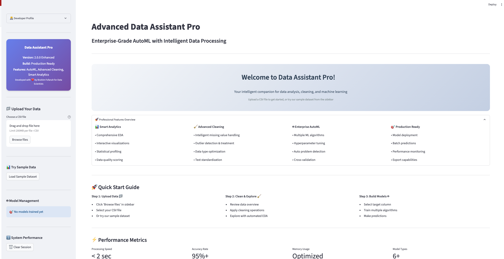

# Data Assistant Pro 🚀

[](https://share.streamlit.io/)
[](https://www.python.org/downloads/)
[](https://opensource.org/licenses/MIT)

An enterprise-grade, end-to-end Streamlit application for automated data cleaning, exploratory data analysis (EDA), and machine learning.



---

## ✨ Key Features

### 🔍 **Advanced Data Analysis**
-   **🤖 Automated EDA:** Comprehensive interactive dashboard with data types, missing values, distributions, and correlations
-   **📊 Smart File Upload:** Automatic delimiter detection (comma, semicolon, tab, pipe)
-   **🎯 Outlier Detection:** Three methods (IQR, Z-Score, Modified Z-Score) with detailed explanations and visualizations

### 🧹 **Intelligent Data Cleaning**
-   **💧 Missing Value Handling:** Multiple strategies with column-specific application
-   **🔧 Duplicate Removal:** Smart duplicate detection and removal
-   **🛠️ Outlier Treatment:** Remove, cap, replace, or transform outliers with impact analysis
-   **📈 Data Quality Scoring:** Comprehensive quality assessment with actionable insights

### 🤖 **Enterprise AutoML**
-   **🚀 Automated Model Training:** Random Forest, Linear/Logistic Regression, SVM
-   **⚡ Interactive Predictions:** Real-time single predictions with confidence scores
-   **� Batch Predictions:** Upload files for bulk predictions with downloadable results
-   **📊 Model Comparison:** Performance metrics and feature importance analysis

### 🎨 **Professional UI/UX**
-   **👨‍💼 Expandable Developer Profile:** Professional presentation with expertise showcase
-   **📱 Responsive Design:** Clean, modern interface with dark theme
-   **� Real-time Feedback:** Live progress indicators and detailed operation logs
-   **📋 Export Capabilities:** Download cleaned data, predictions, and reports

---

## 🛠️ Tech Stack

-   **Language:** Python
-   **Framework:** Streamlit
-   **Data Manipulation:** Pandas, NumPy
-   **Machine Learning:** Scikit-learn
-   **Visualization:** Plotly
-   **Logging & Configuration**

---

## ⚙️ Setup and Installation

To run this application locally, please follow these steps:

1.  **Clone the repository:**
    ```bash
    git clone [https://github.com/Denis060/data-assistant-pro.git](https://github.com/Denis060/data-assistant-pro.git)
    cd data-assistant-pro
    ```

2.  **Create and activate a virtual environment:**
    ```bash
    # For macOS/Linux
    python3 -m venv venv
    source venv/bin/activate

    # For Windows
    python -m venv venv
    .\venv\Scripts\activate
    ```

3.  **Install the required dependencies:**
    ```bash
    pip install -r requirements.txt
    ```

---

## 🚀 How to Run

### Local Development
Once the setup is complete, you can launch the application with the following command:

```bash
streamlit run app.py
```

### 🌐 Live Demo on Streamlit Cloud

**Deploy your own instance:**

1. **Fork this repository** on GitHub
2. **Visit [Streamlit Cloud](https://share.streamlit.io/)**
3. **Sign in** with your GitHub account
4. **Click "New app"**
5. **Select your forked repository**
6. **Set main file path:** `app.py`
7. **Click "Deploy!"**

Your app will be live at: `https://your-app-name.streamlit.app/`

### 📋 Deployment Requirements

The app is ready for deployment with:
- ✅ `requirements.txt` with all dependencies
- ✅ `app.py` as the main application file
- ✅ Modular code structure in `/modules`
- ✅ Sample data in `/data` folder
- ✅ Professional UI configuration

---

## 🎯 Usage Guide

1. **Upload Data:** Drag and drop your CSV file or use the sample dataset
2. **Explore Data:** View automatic EDA reports with statistics and visualizations
3. **Clean Data:** Apply cleaning operations with real-time feedback
4. **Handle Outliers:** Use advanced outlier detection with detailed analysis
5. **Train Models:** Automatically train and compare ML models
6. **Make Predictions:** Interactive predictions and batch processing
7. **Export Results:** Download cleaned data and model predictions